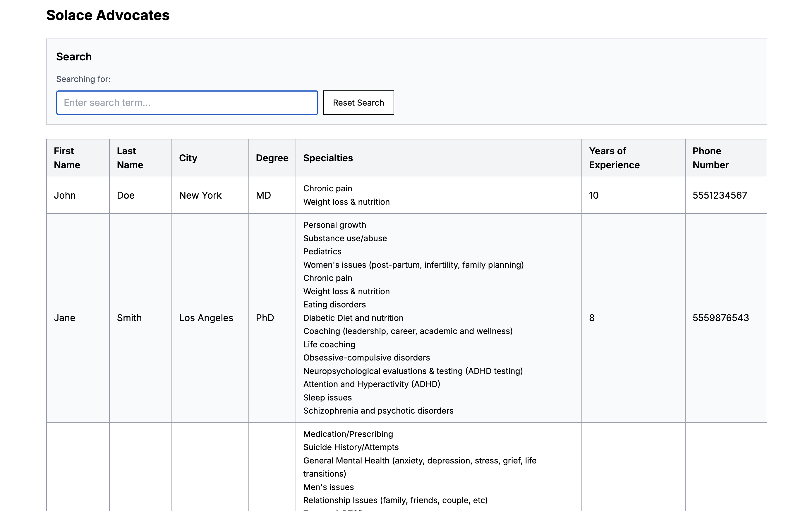
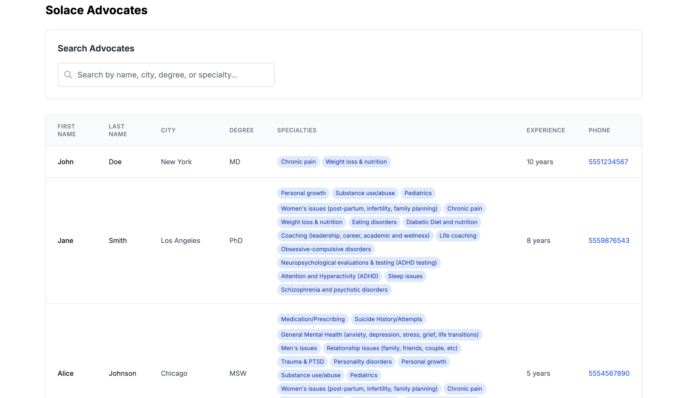
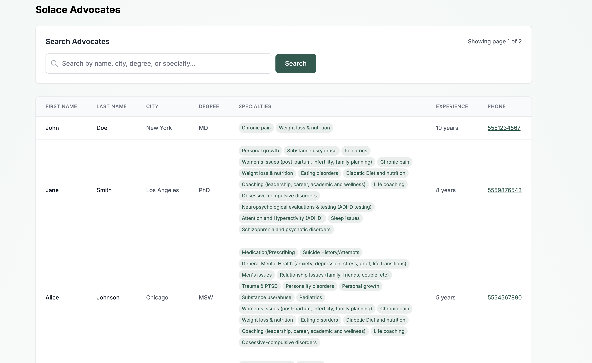

# Discussion

Just dumping some thoughts here and noting what I’ve worked on...

- Updated NextJS to the latest version. Noticed this is the version that has the middleware vulnerability. (https://github.com/stoplion/solace-advocates/pull/1)
- Resolve hydration errors issues in frontend / backend. Get all the code pushed to repo (https://github.com/stoplion/solace-advocates/pull/2)
- Split the search into individual words (["john", "doe"]) to make the search better (https://github.com/stoplion/solace-advocates/pull/3)
  
- Get some super basic styles (no colors atm, just structural / UX improvements) to make presentation a tad better. Nothing fancy, just reorganizing the presentation slightly.
  
- A little more polish to frontend and some small performance tweaks via debouncing, async error handling, and logs removed
- Switched up search from table scan + frontend filtering to backend search, added some pagination, and added some indexes and tidy'd up the frontend a little more add a splash every so slight color (Solace color √). Also removed the debounce & 'search as you type' to a more traditional search button.
   (https://github.com/stoplion/solace-advocates/pull/5)
- Noticed `/src/app/api/seed/route.ts` isn’t protected, but since this is just a demo app, adding auth to the API might not be necessary right now. Skipping.
- Thinking about truncating labels so rows don’t stretch too much. Don’t want to hide info just for the UI though. Probably needs more thought—leaving a note here, won’t tackle it in this demo.
- Some basic security checks (query limit, sql injection blockers, and pagination bounds, etc..)
- I’d like to switch pagination from left/right buttons to page numbers eventually, but for now I’ll stick with arrows. Going to clean up the style and make it pop more so users don’t miss it.
- Move query and pagination into URL parameters, and update the main header to use a legend style.
  
